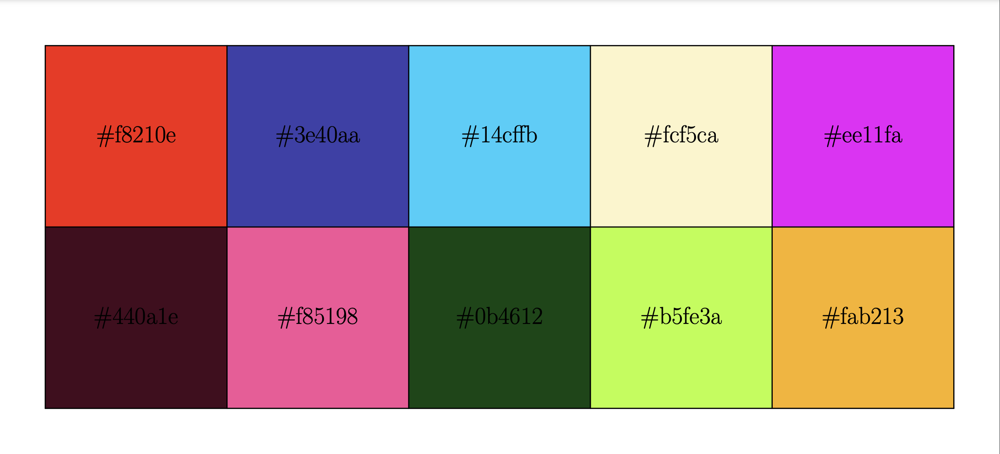

# Color Palette

Create perceptually different colors. I used this for creating a color palette for my custom university lecture schedule to randomly select distinct colors for courses.

It starts with randomly selected colors and based on the distance in CIELAB space, iteratively changes colors to achieve greater min distance.

You can just print the color list if you do not want the Asymptote output.

